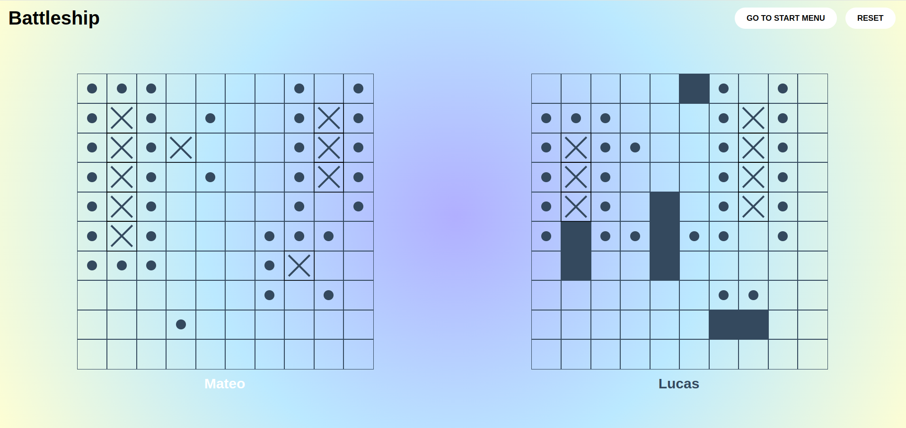

# Battleship

Battleship is the final project of the JavaScript course of The Odin Project. The main objective of this project was to demonstrate TDD (test-driven development) skills using Jest, among other skills learned throughout the course.

## [Live Demo](https://mateoo04.github.io/battleship/)

## Technologies used

- HTML + CSS
- JavaScript
- Webpack
- Babel
- Jest
